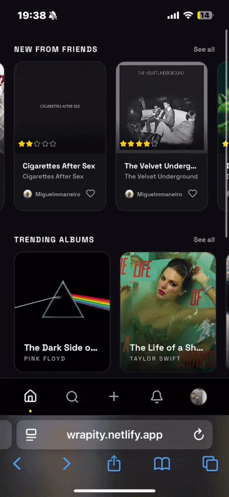

<div align="center">

# Wrapity

Rate albums. Write reviews. See what your friends are listening to.

[](https://angular.dev)
[](https://www.typescriptlang.org)
[](LICENSE)

<picture>
  
</picture>

</div>

<br/>

## Why this project?

Letterboxd exists for films. Goodreads for books. Nothing nailed albums on mobile with a real social layer. I wanted something with a follow graph, activity feeds, and a diary that felt native on your phone.

## How it works

Reviewing an album takes three steps:

```
Search "The Dark Side of the Moon"
              ↓
  The Dark Side of the Moon · Pink Floyd · 1973
  ★★★★½  ·  1,204 reviews
              ↓
  ★★★★★  "Still the greatest record ever made."
```

Every rating lands on your profile and on your followers' home feeds.

Your listening history builds up over time:

```
/users/username
├── Favorites    ← up to 4 pinned albums on your shelf
├── Reviews      ← every rating and review you've written
└── Diary        ← chronological listen log, grouped by month
```

## Features

- **Album pages** — cover art, tracklist, community rating breakdown, and paginated reviews
- **Artist pages** — full discography with per-album average ratings
- **Reviews** — 1–5 star ratings with optional text, editable at any time
- **Likes** — like reviews from anyone in the community
- **Profiles** — favorites shelf, review archive, and monthly listening diary
- **Follow system** — follow users and get their reviews in your home feed
- **Activity feed** — reviews, likes, and follows from people you follow
- **Search** — albums, artists, and users with instant results
- **Public browsing** — album, artist, and profile pages work without an account

## Quick Start

Requires Node.js 20+ and the [backend](https://github.com/nicolasgarea/wrapity-api) running at `localhost:8000`.

```bash
npm install
npm start
# http://localhost:4200
```

To point the app at a different API, edit `src/environments/environment.development.ts`:

```ts
export const environment = {
  production: false,
  apiUrl: 'http://your-api-url',
};
```

After any backend schema change, regenerate the TypeScript client:

```bash
make generate-models
```

## Project Structure

```
src/app/
├── core/
│   ├── guards/          ← auth, public, optional-auth route guards
│   ├── interceptors/    ← attaches Bearer token to outgoing requests
│   ├── models/          ← OpenAPI-generated TypeScript models (do not edit)
│   └── services/        ← album, artist, auth, activity, review, user, like, favorite
│
├── features/
│   ├── activity/        ← activity feed
│   ├── albums/          ← album detail, review editor
│   ├── artists/         ← artist detail with discography
│   ├── auth/            ← login, register
│   ├── home/            ← trending albums, recent reviews, following feed
│   ├── profile/         ← profile view, edit profile, edit favorites
│   ├── search/          ← search page; primary entry point for reviewing albums
│   └── user-connections/← followers and following lists
│
├── layout/              ← root shell: navbar + router outlet
│
└── shared/
    ├── album-grid/      ← reusable album grid with optional rating overlay
    ├── carousel/        ← horizontal scroll carousel
    ├── like-button/
    ├── logo/
    └── navbar/          ← bottom navbar (mobile) and sidebar (desktop)
```

## Roadmap

- [ ] Album lists — custom collections
- [x] Artist pages
- [x] Activity feed
- [x] Likes on reviews
- [x] Search — albums, artists, users
- [x] Edit profile and favorites
- [x] User profiles with diary
- [x] Follow system
- [x] Auth — register and login
- [x] Album detail with community reviews

## License

[MIT](LICENSE)
